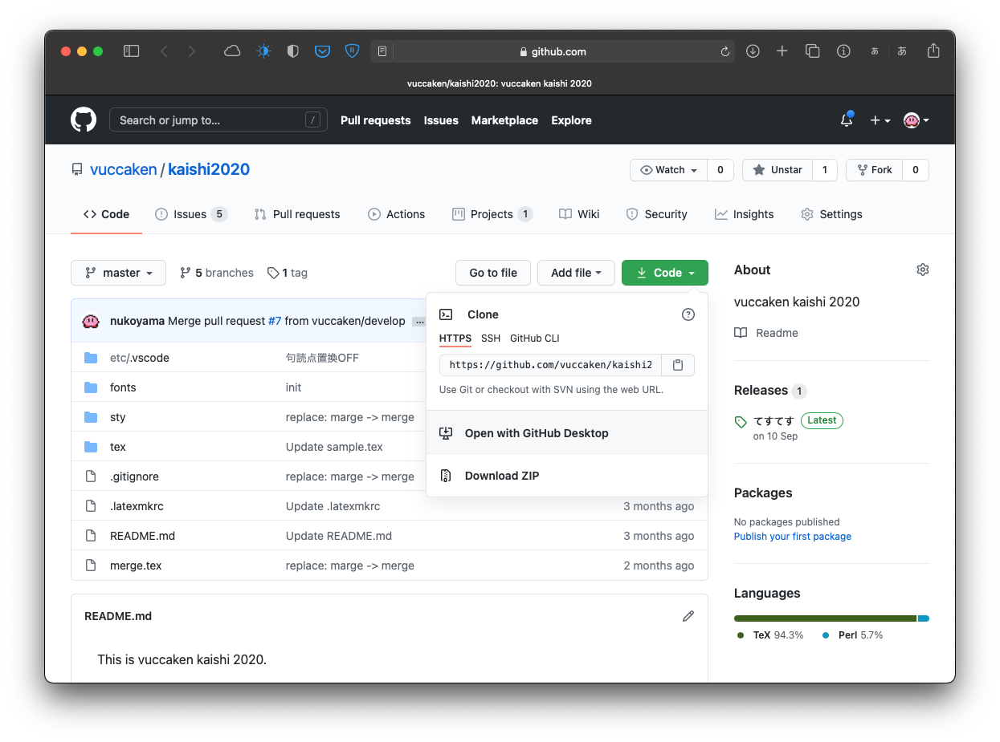
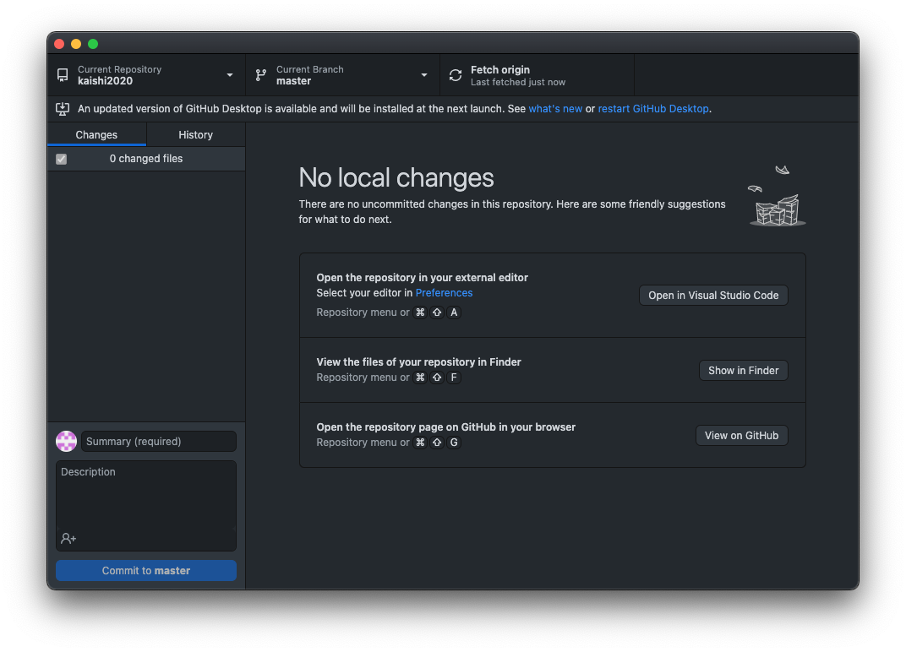
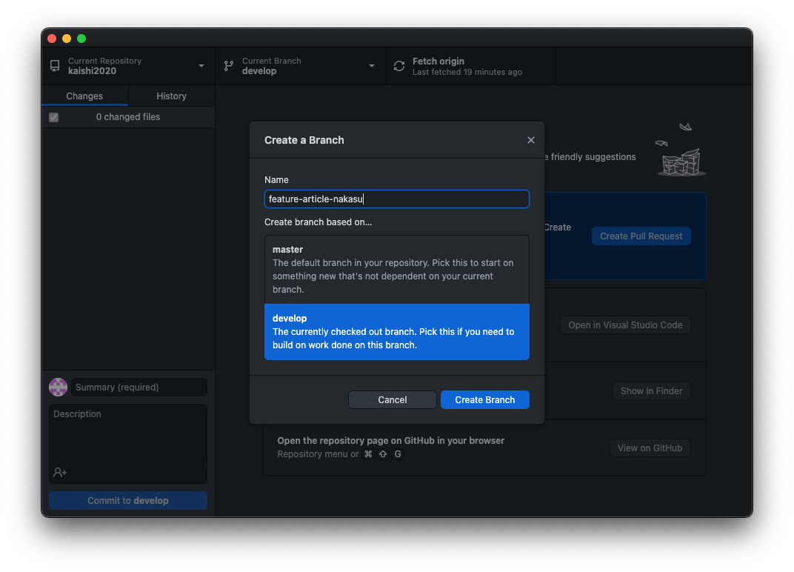
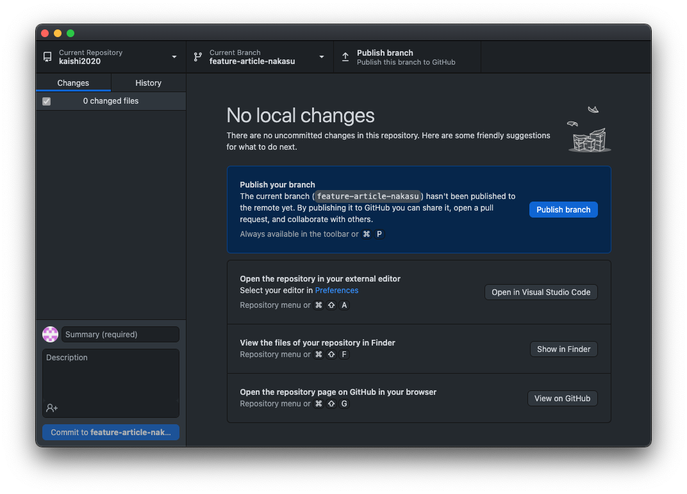
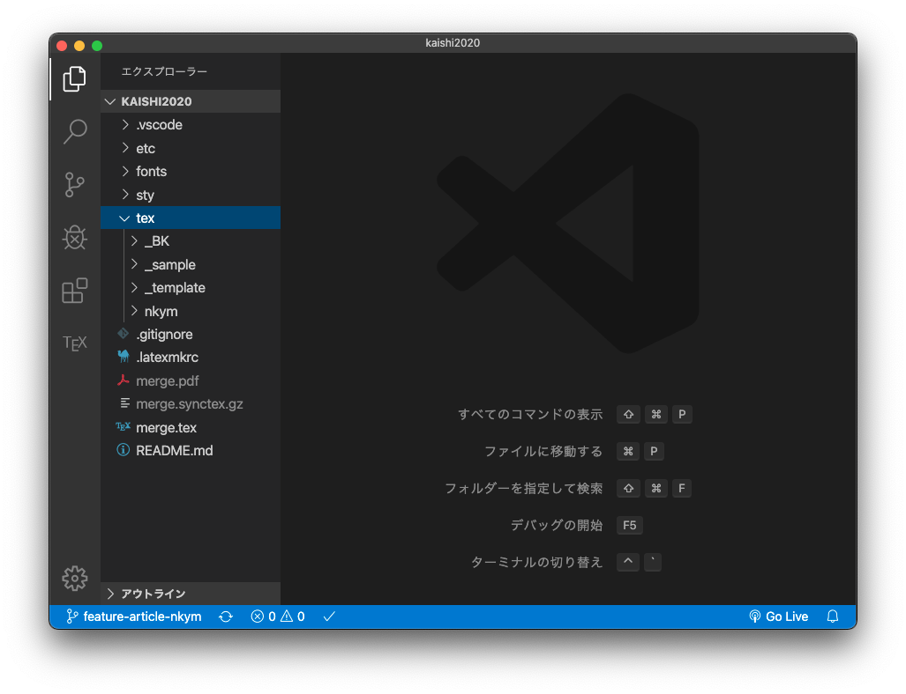

# はじめに

このページでは、会誌（kaishi）で自分の記事を書くための手順を **簡潔に** 述べます。

会誌はもちろん LaTeX を使って書いてもらいます。

2020年度の会誌のリポジトリです；

- [vuccaken/kaishi2020 - GitHub](https://github.com/vuccaken/kaishi2020){target=_blank}


# そもそも

まず前提として、次の3つを自分のPCにインストールしてください；

- LaTeX（TeX Live）
- vscode（エディタ）
- GitHub Desktop（Git の GUI アプリ）

以下で簡単に説明します。

## LaTeX のインストール

会誌は Word じゃなくて LaTeX で書いてもらいます。

[この記事](tutorial01.md#pc)
に従って、LaTeX をインストールしてください。

!!! tip
    今どきはクラウドの時代で、LaTeX においても [Overleaf](https://www.overleaf.com){target=_blank} という Web サービスを利用することで、わざわざ自分の PC に LaTeX をインストールしないでも、オンライン上で LaTeX の文書の編集・タイプセットが無料で行えるのですが、Overleaf を GitHub と連携して利用するためには有料プランに加入しなくてはならず、我々はケチケチとオフラインでてふてふすることを基本としました。

## vscode のインストール

Visual Studio Code（略して vscode）は、Microsoft製のエディタです。

エディタは何でもいいのですが、各々の環境に合わせて設定（を説明）するのは面倒なので、
とくにこだわりのない人は全員 vscode を使ってください。

[この記事](tutorial01.md#vscode)
に従って、vscode と、その拡張機能「LaTeX Workshop」をインストールしてください。

!!! info
    コマンドラインからのタイプセット方法は[次の記事](kaishi02.md#typeset)で説明しています。

## GitHub のアカウント作成

詳しくは説明しませんが、ファイルのバージョン管理ツールとして「Git」というものがあります。

会誌の作成では、Git を利用したサービスのひとつである「[GitHub](https://github.com){target=_blank}」を利用します。

GitHub というWebサービスを利用することで、会誌の共同開発が可能になります。

まずは、[GitHub のサイト](https://github.com) に飛んでもらって、
各自アカウントを作成してください。

自分のアカウントが作成できたら、[物科研の Organization](https://github.com/vuccaken){target=_blank} に参加してもらいます。

既に参加済みの人に、自分の GitHub アカウントを教えて、招待してもらってください。


## GitHub Desktop のインストール

Git の CUI（コマンドライン）での操作は初心者には大変なので、
GUI アプリの「[GitHub Desktop](https://desktop.github.com){target=_blank}」
を利用することにします。

下記リンクから GitHub Desktop をインストールしてください；

- [GitHub Desktop | Simple collaboration from your desktop](https://desktop.github.com)

!!! info
    GitHub を利用するには、まず Git がインストール済みである必要があります。  
    Mac では標準で Git がインストール済みですが、Windows ではそうではありません。  
    しかし、GitHub Desktop に Git が付属しているらしいので、結局気にしなくてよいです。

!!! Tip
    デフォルトのエディタを vscode に設定しておくとよいです。


# 会誌の作成

## 会誌リポジトリのクローン

GitHub にある本年度の会誌を丸ごと自分のPCにクローン（ダウンロード＆git管理）します。

[会誌のリポジトリ](https://github.com/vuccaken/kaishi2020){target=_blank} へアクセスし、
「Code」と書いてある緑色のボタンをクリックし、「Open with GitHub Desktop」を選択します。



GitHub Desktop で開いたら、「Local Path」を好きな所に設定して、リポジトリをクローンします。

以上で、自分のPC内で会誌を編集することができるようになりました。


## 自分の記事の作成

まず、テキトーに自分の名前を決めましょう（以下、`<NAME>` とする）。
他人と識別さえできれば何でもいいです。
あとでファイル名などに使用します。

例えば、`nkym` とか `Crazy_Apple` とか `kasumin0123` とかで、使える文字はアルファベットか数字ぐらいです。
無難に苗字のローマ字でいいです。


### 自分の作業 Branch を作成

!!! info
    Git には Branch と呼ばれる機能があります。
    あるプロジェクトから分岐させる（Branchを作る）ことで、そのプロジェクトとは独立に開発を進めることができます。
    複数人での並行作業において、ファイル編集の競合（Conflict）が起こりにくくするために利用します。

GitHub Desktop で会誌のリポジトリを開きます。



ウインドウ上部中央にある「Current Branch」をクリックし、
`develop` ブランチを選択します。
これで、 `develop` ブランチへ移動（チェックアウト）できました。

Current Branch が `develop` になっていることが確認できたら、
もう一度「Current Branch」をクリックして、今度は「New Branch」ボタンをクリックします。



「Name」には、さっき決めた自分の名前を `<NAME>` として、次のような名前でブランチ名を入力します；

```
feature-article-<NAME>
```

「Create branch based on...」は `master` ではなく `develop` ブランチを選択してください。

「Create Branch」ボタンを押して、新しいブランチを作成します。

以後、このブランチが、自分の記事を編集する作業ブランチとなります。

記事更新の作業する際は、「Current Branch」が `master` や `develop` ではなく、
自分の作業ブランチ `feature-article-<NAME>` になっていることを確認してください。

### 作成した Branch をリモートへ反映

先ほど作成したブランチはまだローカルにしか存在していません。

リモートリポジトリにも反映させるためには、上部右上の「Publish branch」ボタンをクリックします。



これでリモートのGitHubにあるリポジトリ上でも、ブランチが作成されました。

### 自分の作業ディレクトリを作成

これからの作業は、自分の作業ブランチ `feature-article-<NAME>` で行いましょう。

まずは、自分の会誌記事を入れておく作業ディレクトリを作成します。

クローンした会誌のリポジトリを vscode で開きます。

!!! info
    GitHub Desktop アプリでリポジトリを表示し
    
    - `cmd + shift + A` (mac)
    - `ctrl + shift + A` (windows)
    
    のキーバインドを入力すれば、自動でリポジトリをデフォルトで設定したエディタで開いてくれます。



kaishi の `/tex/` ディレクトリ以下に、自分の名前でディレクトリを作成します；

```hl_lines="4"
/tex/
  |- _BK
  |- ...
  |- <NAME>/
  ...
```

次に、その中に同じ名前（`<NAME>`）で tex ファイルと sty ファイルを作成します；

```hl_lines="5 6"
/tex/
  |- _BK
  |- ...
  |- <NAME>/
  |   |- <NAME>.sty
  |   `- <NAME>.tex
  ...
```

さらに、画像を入れておくディレクトリ `img/` を作成します；

```hl_lines="5"
/tex/
  |- _BK
  |- ...
  |- <NAME>/
  |   |- img/
  |   |- <NAME>.sty
  |   `- <NAME>.tex
  ...
```

!!! info
    vscode では、左のツリービューで表示されているディレクトリを右クリックすれば、新規ファイルやディレクトリの作成ができます。

!!! attention
    `.gitignore` の設定で、`/tex/*/` の階層にある pdf ファイルは無視するようにしているので、
    記事に挿入するために用意した pdf をそこに直置きしてしまうと、リモートにはアップロードしてくれません。

    なので、名前は何でもいいので、サブディレクトリ `img/` を作成し、その中に画像ファイルを入れてください。

最後に、`/tex/_template/template.tex` の内容を丸々コピーしてきて、作成した自分の tex ファイルにペーストします。

プリアンブルの `\usepackage{template}` のところを、
自分の sty ファイル名 `\usepackage{<NAME>}` に変更してください。


## 会誌のタイプセット（vscode） {: #typeset-with-vscode}

### 設定ファイルの配置

タイプセットは vscode で行います。

はじめに、vscode の設定ファイルを配置します。

`/etc/` ディレクトリにある `.vscode/settings.json` を **コピー** して、
一番上の階層にペーストします；

```hl_lines="2 3"
kaishi/
  |- .vscode/        % ここにペースト
  |     `- settings.json
  |- ect/
  |   `- .vscode/    % これをコピー
  |         `- settings.json
  |- fonts/
  |- sty/
  |- tex/
  ...
```

一旦 vscode を再起動します。
改めて会誌のリポジトリを開いてください。

!!! info
    初めから用意していた `settings.json` はあくまでテンプレのつもりです。

    再配置した `/.vscode/settings.json` は `.gitignore` に指定してあるので、
    カスタムしたい人は自由に編集してください。
    （`/ect/` の中にある方はそのまま残しておいてください）


### タイプセット

設定ファイルを配置したら、会誌のリポジトリを開いて、
自分の会誌記事の tex ファイルを選択してタブで開きます。

左のサイドバーにある「TEX」アイコンをクリックし、
「Build LaTeX project」から「Recipe: kaishi」をクリックすると、タイプセットが始まります。


次からは、`cmd + option + B` でタイプセットできます（Mac）。
Windows の場合は `ctrl + alt + B` です。

タイプセットが完了したら、`cmd + option + V` で生成されたPDFを別タブで表示できます（Mac）。
Windows の場合は `ctrl + alt + V` です。


# 会誌記事の編集・コミット

## 記事の編集

以上で会誌を書くための初期設定は完了です。

あとは普通に会誌を書いていき、以下の作業を繰り返すことでその進捗をリポジトリに反映します。

会誌を書くにあたっては、いくつか注意点がありますが、それは後で述べることにします。

以下ではまず、ファイルの編集・追加などの変更を Git で管理する方法を説明します。


## 変更内容を Commit

会誌の編集は Git で管理されます。

ここまでの変更をコミットしてみましょう。

GitHub Desktop を開くと、変更した部分が表示されています。


左下の入力ボックスに変更内容の説明（コミットメッセージ）を書いて、変更内容をコミットします。
最初のコミットなので、変更の説明は `init` とでもしておきましょう。

!!! tip
    変更が単一のファイルのみの場合は、変更の説明にデフォルトで `Update <FileName>` と入力されています。
    変更の内容は記事の更新ぐらいしかないので、以降はそのコミットメッセージのままコミットするだけでいいです。

    コミットメッセージ入力欄の下の「Discription」には、変更内容の詳細が書けます。
    こちらは任意なので、好きにしてもらったらいいです。

コミットメッセージが書けたら、青色の「Commit to `feature-article-<NAME>`」ボタンをクリックして、
自分の作業ブランチ `feature-article-<NAME>` に変更内容をコミットします。

まだローカルにしかコミットが反映されていないので、
ウインドウ上部右にある「Push origin」をクリックしてプッシュします。


これで、リモートの方にも変更が反映されました。

編集してコミットしてプッシュ、これの繰り返しが会誌記事更新の基本作業となります。

!!! info
    コミットのタイミングは各自に任せますが、例えば、セクションがひとつ書き終わったとか、一日の作業の終りのタイミングで行ってもらえれば良いかと思います。

    コミットはただのセーブのようなものだと思ってくれても良いです。


## Fetch & Pull

別の誰かがコミットしていて、ローカル（自分のPC）のリポジトリより、リモートのリポジトリ（GitHub）の方が新しくなっている場合があります。

それを確認するためには「Fetch origin」をクリックしてフェッチをします。
フェッチは自動でも行われますが、たまには自分でも行ってください。

もし、ローカルよりもリモートのリポジトリの方が新しくなっていた場合、
「Pull origin」をクリックしてプルを行えば、最新の変更をローカルに反映します。


## 派生元ブランチの変更を取り入れる

派生元の `develop` ブランチが新しくなっている場合、その変更を自分の作業ブランチへ取り入れる（マージする）ことができます。

!!! note
    この操作は、派生元ブランチへプルリクエストを行う際に自動で行われます。
    手動で行うのは、全体のバグ修正などで管理者からアナウンスがあったときぐらいで十分です。

    とりあえずこの操作のことは気にせず、自分の会誌記事の更新作業に集中してもらえば良いかと思います。

この操作を行うには、まずツールバーの「Branch」から「Merge into Current Branch」を選択するか、
あるいはキーバインド `cmd + shift + M` を入力します（Windowsは `ctrl + shift + M`）。


表示されるポップアップで、派生元である `develop` ブランチを選択し、
「Merge develop into `feature-article-<NAME>`」ボタンを押します。

競合がなければ、すぐに自動でマージが行われます。

!!! attention
    競合があるときは、どちらの変更を取り入れるか自分で判断する必要があります。
    もし何か競合してしまったら、管理者に相談してください。

マージがうまくいったら、リモートのブランチにも反映させるためにプッシュをします。


## Pull Request

今は自分のブランチ内でしか変更が反映されていないので、
進捗がある程度キリのいいところまでいったら、
全体と統合するために 派生元である `develop` ブランチへプルリクエストを行います。

!!! info
    `develop` ブランチとマージするときは、バグや競合がないかをチェックするために、プルリクエストを行います。
    競合のチェックはGitが自動で行ってくれます（競合があった場合の修正は手動で行う）。

    リポジトリの管理者からマージ許可が降りたら、管理者がそのプルリクエストを `develop` ブランチへマージします。


「Create Pull Request」ボタンをクリックするか `cmd + R` を入力すると、
ブラウザでプルリクエスト画面が表示されます。


「compare:」のところに自分のブランチが、「base:」のところに `develop` ブランチが表示されるように設定して、
「Create pull request」ボタンをクリックします。
任意でコメントを付けることもできます。

問題がなければ、「Marge pull request」というボタンが表示されますが、
ここから先は自分1人では行わないでください。

会誌のリポジトリの管理者が、問題がないかチェックしてからマージを行います。

!!! note
    誰かがプルリクエストを行ったら、みんなで会誌記事の校正をしてあげましょう。
    プルリクエストのページから、それに対してコメントができるのでうまく利用してください。

!!! note
    システム的には全員が管理者権限を持っているので、全員の校正が済んだら、適当な誰かがマージを実行すれば良いと思います。
    マージはプルリクエストのページ（GitHub上）で行うことができます。


## 会誌の編集手順まとめ

以上で、主に必要なGit操作の説明を一通り行いました。

会誌記事更新で、繰り返し行う必要がある作業は以下のとおりです；

1. fetch & pull でローカルのリポジトリを最新に保つ
2. 会誌記事を書く
3. 変更を commit する
4. push で変更をリモートに反映

会誌が完成したら、以下の作業を行います；

1. 派生元の `develop` ブランチの最新の変更を自分のブランチへ取り入れる（マージする）
2. 競合がなければ、自分の作業ブランチを `develop` ブランチに pull request する
3. 他の人に構成してもらって、適宜修正する

管理者によって、無事にプルリクエストがマージされれば完了です。


# 会誌記事を書くときの注意点（ルール）

会誌は好きに書いても良いとは言っても、全員の記事を統合したりする関係でいくつかルールがあります。

詳しくは[次の記事](kaishi02.md)で行うことにして、ここでは最低限必要なことについてだけ、簡単に述べることにします。


## プリアンブル

`#!tex \documentclass{}` と `#!tex \begin{document}` の間の領域をプリアンブルと言います。

プリアンブルに書いた内容は、全員の記事を統合する（`merge.tex` で読み込む）際には無視されてしまいます。

パッケージ（sty ファイル）の読み込みや、マクロの定義は、最初に作成した自分の sty ファイルの中に書いてください。

書き方は、普通にプリアンブルに書くときと同じでいいです。

!!! example
    ```tex
    %% This file is `nakasu.sty`

    \usepackage{amsmath}
    \usepackage{physics}

    \newcomannd\kawaii[1]{#1 かわいい}
    ...
    ```

    ```tex
    %% This file is `nakasu.tex`

    \documentclass[uplatex,dvipdfmx]{vkaishi}

    \usepackage{vuccaken}
    \usepakage{nakasu} % 自分のstyファイル

    %% ここに何か書いても、統合する際には無視されてしまう
    %% \usepackage やマクロの定義は自分のstyファイル内で行う

    \begin{document}
    ...
    ```

!!! failure
    どうしてこんな面倒なことをしなきゃいけないのか疑問に思うかもしれませんが、理由は簡単で、ただ単に kaishi 開発者のプログラミング力が足りなくて実装できなかっただけです。すいません。

## 会誌のタイトル

`\maketitle` コマンドで、会誌のタイトルなどを出力します。

タイトルを `\title` で、著者名を `\author` で、
所属学科と学年を `\belong` でそれぞれ指定してください。

!!! example
    ```tex
    \title{無敵級*ビリーバー} % タイトル
    \author[中須]{かすみ}    % 名前
    \belong{普通科}{1}      % 学部学科・回生

    \maketitle             % タイトル出力
    ```

!!! info
    標準で定義されている `\maketitle` コマンドや `\title` コマンドを改造（再定義）しています。


## 目次

確認用の目次を `\mokuji{<depth>}` で出力します。

目次の確認が不要の場合は、コメントアウトしておいてください。


## 見出し

見出しは `\section` 以下であれば好きに使ってもらってよいです。

ただし、`\chapter` は使わないでください。

!!! info
    会誌の記事タイトルが、`\chapter` に相当します。


## 参考文献

参考文献は `thebibliography` 環境で出力します。

形式はテンプレで示しているものがおそらく正しいので、できるだけその形式を守ってください。


# おわりに

多分、よくわからないと思います。

Git とか vscode とかが、何もしてないのに勝手におかしくなったりしたら、
GitHub の会誌のリポジトリに「[Issues](https://github.com/vuccaken/kaishi2020/issues){target=_blank}」というページがあるので、
そこで質問を投げてください。

リポジトリの Issues タブにアクセスしたら、「New issue」を押して、
質問タイトルとその内容を入力して、「Submit new issue」を押せば、質問を投稿できます。

そうすれば、1営業日以内に、
上級生が懇切丁寧に問題解決に協力してくれます。